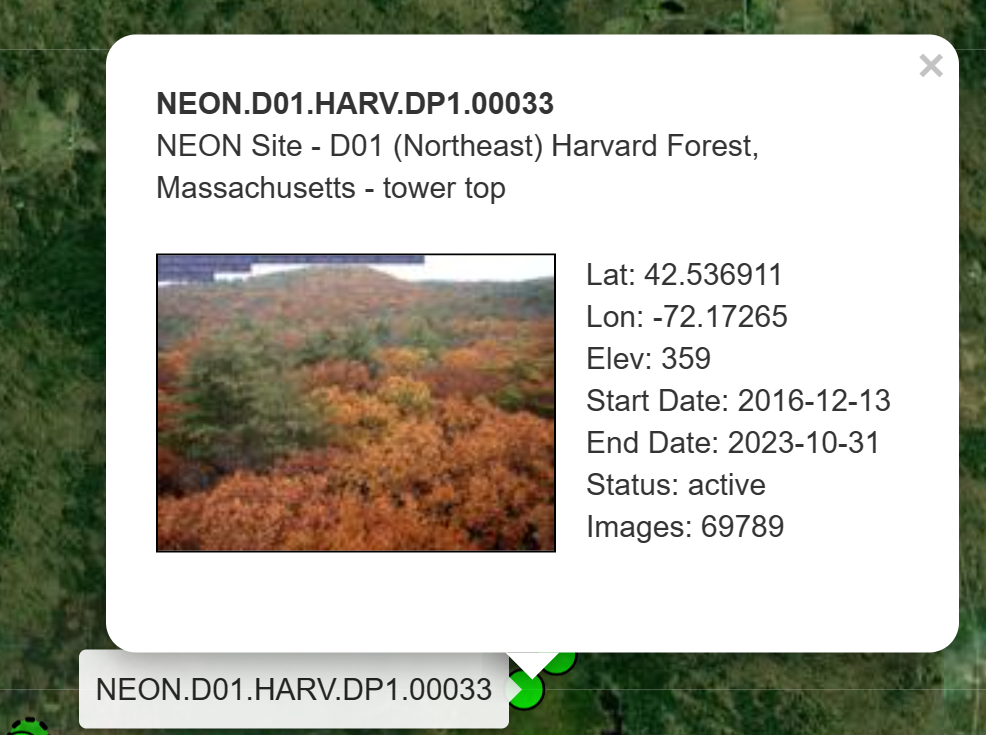
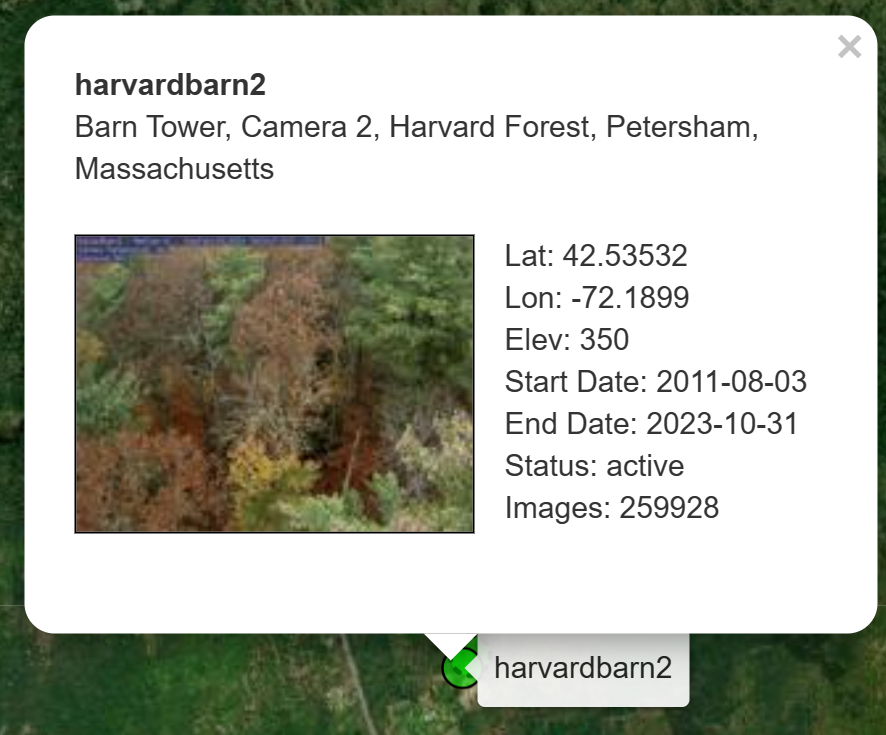

```{r setup, include=FALSE}
knitr::opts_chunk$set(echo = TRUE)
```

---

### Exercise 1 - Optimization Methods

*The following describes, how the model implemented in Chapter 6 to regionally scale phenology can be optimized:*

1) The scaling could be optimized by using more than 1 station in the model. This would increase the number of observations the model is based on and should therefore make predictions more robust.

2) One could also implement a different parameter opitimization method instead of simulated annealing such as Bayesian optimization e.g. through `{Bayesian Tools}`.

3) A third method to potentially improve the method is to increase the number of parameters that are taken into the model. These should be based on a physical understanding of phenology e.g. sunshine hours. 

---

### Exercise 2 - Implementation of Optimization Proposal 1)

library setup:

```{r libraries}
library(here)
library(phenocamr)
library(tidyverse)
library(GenSA)
library(geodata)
library(dplyr)
library(ggplot2)
library(ggpubr)
library(patchwork)
library(daymetr)
library(leaflet)
library(MODISTools)
library(tidyterra)
library(reshape2)
```

Downloading greenness time series of the original harvard station (+ two further sites that are closest to harvard to enhance *n*) and calculating phenology (phenophases) and amending with DAYMET data.
The chosen sites are: 

{#id .class width=40% height=40%}
{#id .class width=40% height=40%}
{#id .class width=40% height=40%}

```{r download phenocam}
phenocamr::download_phenocam( #to improve the model, can include more sites i.e. increase n
  site = "harvard$",
  veg_type = "DB",
  roi_id = "1000",
  daymet = TRUE,
  phenophase = TRUE,
  trim = 2022,
  out_dir = tempdir()
)
phenocamr::download_phenocam( #to improve the model, can include more sites i.e. increase n
  site = "NEON.D01.HARV.DP1.00033$",
  veg_type = "DB",
  roi_id = "1000",
  daymet = TRUE,
  phenophase = TRUE,
  trim = 2022,
  out_dir = tempdir()
)
phenocamr::download_phenocam( #to improve the model, can include more sites i.e. increase n
  site = "harvardbarn2$",
  veg_type = "DB",
  roi_id = "1000",
  daymet = TRUE,
  phenophase = TRUE,
  trim = 2022,
  out_dir = tempdir()
)


harvard_phenocam_data <- readr::read_csv(
  file.path(tempdir(), "harvard_DB_1000_3day.csv"),
  comment = "#"
)
harvardbarn_phenocam_data <- readr::read_csv(
  file.path(tempdir(), "harvardbarn2_DB_1000_3day.csv"),
  comment = "#"
)
NEON_phenocam_data <- readr::read_csv(
  file.path(tempdir(), "NEON.D01.HARV.DP1.00033_DB_1000_3day.csv"),
  comment = "#"
)
```

Reading in harvard phenology only retaining spring (rising) phenology for the GCC 90th percentile time series (the default):
```{r phenology}
harvard_phenology <- readr::read_csv(
  file.path(
    tempdir(),
    "harvard_DB_1000_3day_transition_dates.csv"
  ),
  comment = "#"
) |>
  dplyr::filter(
    direction == "rising",
    gcc_value == "gcc_90"
  )

harvardbarn_phenology <- readr::read_csv(
  file.path(
    tempdir(),
    "harvardbarn2_DB_1000_3day_transition_dates.csv"
  ),
  comment = "#"
) |>
  dplyr::filter(
    direction == "rising",
    gcc_value == "gcc_90"
  )

NEON_phenology <- readr::read_csv(
  file.path(
    tempdir(),
    "NEON.D01.HARV.DP1.00033_DB_1000_3day_transition_dates.csv"
  ),
  comment = "#"
) |>
  dplyr::filter(
    direction == "rising",
    gcc_value == "gcc_90"
  )

```

Return mean daily temperature as well as formal dates (for plotting) and binding the sites together into one dataframe:
```{r temp}
harvard_temp <- harvard_phenocam_data |>
  group_by(year) |>
  dplyr::mutate(
    tmean = (tmax..deg.c. + tmin..deg.c.)/2
  ) |>
  dplyr::mutate(
    date = as.Date(date),
    gdd = cumsum(ifelse(tmean >= 5, tmean - 5, 0))
  ) |>
  dplyr::select(
    date,
    year,
    tmean,
    gdd
  ) |>
  ungroup()

harvardbarn_temp <- harvardbarn_phenocam_data |>
  group_by(year) |>
  dplyr::mutate(
    tmean = (tmax..deg.c. + tmin..deg.c.)/2
  ) |>
  dplyr::mutate(
    date = as.Date(date),
    gdd = cumsum(ifelse(tmean >= 5, tmean - 5, 0))
  ) |>
  dplyr::select(
    date,
    year,
    tmean,
    gdd
  ) |>
  ungroup()

NEON_temp <- NEON_phenocam_data |>
  group_by(year) |>
  dplyr::mutate(
    tmean = (tmax..deg.c. + tmin..deg.c.)/2
  ) |>
  dplyr::mutate(
    date = as.Date(date),
    gdd = cumsum(ifelse(tmean >= 5, tmean - 5, 0))
  ) |>
  dplyr::select(
    date,
    year,
    tmean,
    gdd
  ) |>
  ungroup()

#add an ID to make the sites distinguishable
harvard_temp$ID <- "harvard"
harvardbarn_temp$ID <- "harvardbarn"
NEON_temp$ID <- "NEON"

station_temp <- rbind(harvard_temp, harvardbarn_temp, NEON_temp)

```
Convert the harvard phenology data and only retain required data. ALso binding all phenology data into one dataframe again.
```{r phenology conversion}
harvard_phenology <- harvard_phenology |>
  mutate(
    doy = as.numeric(format(as.Date(transition_25),"%j")),
    year = as.numeric(format(as.Date(transition_25),"%Y"))
  ) |>
  select(
    year,
    doy,
    transition_25,
    threshold_25
  )

harvardbarn_phenology <- harvardbarn_phenology |>
  mutate(
    doy = as.numeric(format(as.Date(transition_25),"%j")),
    year = as.numeric(format(as.Date(transition_25),"%Y"))
  ) |>
  select(
    year,
    doy,
    transition_25,
    threshold_25
  )

NEON_phenology <- NEON_phenology |>
  mutate(
    doy = as.numeric(format(as.Date(transition_25),"%j")),
    year = as.numeric(format(as.Date(transition_25),"%Y"))
  ) |>
  select(
    year,
    doy,
    transition_25,
    threshold_25
  )

#add an ID again
harvard_phenology$ID <-"harvard"
harvardbarn_phenology$ID <- "harvardbarn"
NEON_phenology$ID <- "NEON"

station_phenology <- rbind(harvard_phenology, harvardbarn_phenology, NEON_phenology)

```

__Growing degree day model optimization:__
```{r GDD model}
#calling functions from the function file:
source("functions.R")

# starting model parameters - randomly chosen
par = c(0, 120)

# limits to the parameter space
lower <- c(-10,0)
upper <- c(45,500)

# data needs to be provided in a consistent single data file, a nested data structure
# will therefore accept non standard data formats
data <- list(
  drivers = station_temp,
  validation = station_phenology
)

#for comparison with original model:
data_harvard <- list(
  drivers = harvard_temp,
  validation = harvard_phenology
)

# optimize the model parameters
optim_par = GenSA::GenSA(
  par = par,
  fn = rmse_gdd,
  lower = lower,
  upper = upper,
  control = list(
    max.call = 4000
  ),
  data = data
)$par

optim_par_ha = GenSA::GenSA( #for harvard only
  par = par,
  fn = rmse_gdd,
  lower = lower,
  upper = upper,
  control = list(
    max.call = 4000
  ),
  data = data_harvard
)$par


```

Now run the model for all years to get the phenology predictions:
```{r model run}
predictions <- station_temp |>
  group_by(year) |>
  summarize(
    prediction = gdd_model(
      temp = tmean,
      par = optim_par
    )
  )

 predictions_ha <- harvard_temp |>
   group_by(year) |>
   summarize(
     prediction = gdd_model(
       temp = tmean,
       par = optim_par_ha
     )
   )

# join predicted with observed data
validation <- left_join(predictions, station_phenology)
validation_ha <- left_join(predictions_ha, harvard_phenology)

```
We can now plot the predicted vs observed DOY to see how well the model does:
```{r plotting, echo=FALSE}
# join predicted with observed data
validation <- left_join(predictions, station_phenology)
validation_ha <- left_join(predictions_ha, harvard_phenology)

plot_allsites <- ggplot(validation) + #trying to combine both plots into one??
  geom_smooth(
    aes(
      doy,
      prediction
    ),
    colour = "grey25",
    method = "lm"
  ) +
  geom_point(
    aes(
      doy,
      prediction
    ))+
  geom_abline(
    intercept=0,
    slope=1,
    linetype="dotted"
  ) +
  labs(
    x = "Observed leaf-out date (DOY)",
    y = "Predicted leaf-out date (DOY)"
  ) +
  annotate("text", x = 121, y = 138,
           label = paste("With additional sites"), color = "black", size = 4) +
  theme_bw()  +
  theme(legend.position = "none")

plot_harvard <- ggplot(validation_ha) + #for comparing with harvard alone
  geom_smooth(
    aes(
      doy,
      prediction
    ),
    colour = "red",
    method = "lm"
  ) +
  geom_point(
    aes(
      doy,
      prediction
    )
  ) +
  geom_abline(
    intercept=0,
    slope=1,
    linetype="dotted"
  ) +
  labs(
    x = "Observed leaf-out date (DOY)",
    y = "Predicted leaf-out date (DOY)"
  ) +
  annotate("text", x = 121, y = 136,
           label = paste("Harvard site alone"), color = "red3", size = 4) +
  theme_bw()  +
  theme(
    legend.position = "none"
  )

ggarrange(plot_harvard, plot_allsites, ncol=2)
```

It becomes apparent quite quickly that including more sites into the model has actually made the predictions worse compared to the observed DOY since the black line deviates even further from the ideal diagonal than the red line (harvard alone).

---

### Exercise 3 - Statistical comparison with the MODIS MCD12Q2 phenology product

*the MODIS phenology product is another set of observational data that we compare our model data to*

We first have to download the MODIS data that is appropriate for comparison i.e.

- similar geographical location (here 20km l/r and a/b the harvard site as that should include the 2 additional sites)

- similar timescale, we have data from 2008-2022 in our DOY model:
```{r MODIS download}
# load libraries
library(MODISTools)

# download and save phenology data
phenology <- MODISTools::mt_subset(
  product = "MCD12Q2",
  lat = 42.53, #lat of harvard
  lon = -72.17, #lon of harvard
  band = "Greenup.Num_Modes_01",
  start = "2008-01-01",
  end = "2022-12-31",
  km_lr = 20, #decreased to around 20km around harvard to get the same spatial scale as the sites selected for model
  km_ab = 20, #same here
  site_name = "swiss",
  internal = TRUE,
  progress = FALSE
)

```
To be able to compare the MODIS product with our data, have to screen and transform the data:
```{r screening}
# screening of data
phenology <- phenology |>
  mutate(
    value = ifelse(value > 32656, NA, value),
    value = as.numeric(format(as.Date("1970-01-01") + value, "%j")),
    value = ifelse (value < 200, value, NA)
  )

#select DOY (value) and change the calendar dates to years so we can average by year
phenology_filtered <- phenology |>
    select(
      value,
      calendar_date
    )  |>
      mutate(
        calendar_date = format(as.Date(calendar_date), "%Y"
      )) |>
  group_by(calendar_date) |> #group by the years
    summarize(
      DOY_modis = mean(value, na.rm=T)) #take mean over all pixels
```
For statistical evaluation we bind both the predicted and MODIS data together:
```{r data binding}
#both dataoutputs combined:
phenology_stats <- cbind(predictions$year, predictions$prediction, phenology_filtered$DOY_modis)
colnames(phenology_stats) <- c("year","DOY_pred","DOY_modis")
phenology_stats <- as.data.frame(phenology_stats)

```
__Statistical evaluation__

*Null hypothesis:* both products are the same i.e. spread on a diagonal plotted against each other.

*alternative hypothesis:* the products differ from each other.

We can first have a look at the `R base` statistics:
```{r summary stats}
summary(phenology_stats[c(2,3)])
```
For hypothesis testing, we can use a test of no-difference e.g. the Mann-Whitney-U-test (non-parametric test for unrelated samples as normality of the datasets not known). In this test, the sample with the lower median must come first i.e. the `DOY_modis` dataset.

*[Source: https://www.methodenberatung.uzh.ch/de/datenanalyse_spss/unterschiede/zentral/mann.html]*

```{r MW test}
MWtest_phen <- wilcox.test(phenology_stats$DOY_modis, phenology_stats$DOY_pred)
Wvalue_phen<-round(MWtest_phen$statistic, 2)
P_phen<-round(MWtest_phen$p.value, 3)
if (MWtest_phen$p.value < 0.05) {P_phen = "<0.05"}
MWtest_phen #signficantly different
```
We can also use a linear model to see how much of the observed data can be explained by the predicted model DOY. When plotted against each other, we would ideally get a slope-value of 1 and an intercept of 0 if the model data was able to explain 100% of the observed MODIS data.
```{r linear trends}
#compute slope of linear model
lineartrend_phen <- lm(DOY_pred ~ DOY_modis, data= phenology_stats) ##linear trend, simple regression
phen_slope <- round(lineartrend_phen$coefficients[2], 3) #slope of lm
phen_intercept <- round(lineartrend_phen$coefficients[1], 3) #intercept
#formula for linear model: ideally would have Y = X, but in reality have Y= 1.03x + 21

```
For further evaluation, we can also look at the correlation of both datasets. In theory if the model was perfect, the correlation would be 1.
```{r corr}
cor_phen <- round(cor(phenology_stats$DOY_modis, phenology_stats$DOY_pred, method = "pearson"),3)
cor_phen 
cor_phen^2 #(i.e. R2) 

```
We can summary these statistics visually:
```{r stats plots, echo = FALSE}
plot1 <- phenology_stats |>
 ggplot(aes(x = DOY_modis, y = DOY_pred)) +
    geom_point(size = 0.75) +
    geom_smooth(method = "lm", color = "skyblue3", fullrange = TRUE) +
    labs(x = expression(paste("DOY MODIS product")),
         y = expression(paste("DOY model predicted"))) +
  geom_abline(
    intercept=0,
    slope=1,
    linetype="dotted"
  ) +
  annotate("text", x = 99.7, y = 139,
           label = paste("Y =", phen_slope, "X +", phen_intercept), color = "skyblue3", size = 4) +
  annotate("text", x = 100, y = 142,
           label = paste("Correlation R = ", cor_phen), color = "black", size = 4) +
  annotate("text", x = 100, y = 136,
           label = paste("MW p-value = ", P_phen), color = "red3", size = 4) +
  #  xlim(0,150)+
  ylim(100,145)+
    theme_classic()

#transform dataframe for plotting as boxplot into long format:
for_plot <- melt(phenology_stats, id.vars = "year")

plot2 <- for_plot |>
ggplot(aes(x = variable, y = value, fill = variable)) +    
  geom_boxplot()+
  theme_classic()

ggarrange(plot1, plot2)

```

__To summarise:__
- The Mann-Whitney-U-test shows that the two datasets are significantly different, i.e. we have to accept the alternative Hypothesis.

- The resulting slope and intercept of the linear model show that the predicted values are signficantly higher than the observed MODIS data for this region (visually shown in the boxplot). 

- Correlation of both datasets is not as high as expected with 0.725; ideally, we would want a value much closer to 1. The R2 value of 0.53 means that the predicted values can only explain 53% of the observed values instead of 100%.


