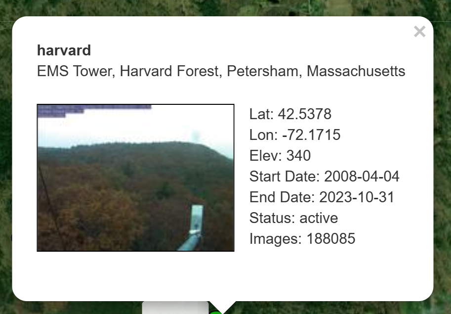

```{r setup, include=FALSE}
knitr::opts_chunk$set(echo = TRUE)
```

---

### Exercise 1 - Optimization Methods

*The following describes, how the phenology model implemented in Chapter 6 from `A Handful of Pixels` can be optimized using three different methods:*

1) The model could be optimized by using more than one station as input data for the model i.e. improve calibration parameters. This would increase the number of observations that are used to calculate the optimal parameters used in the model and should therefore make predictions more robust.

2) One could also implement a different parameter opitimization method instead of simulated annealing, such as Bayesian optimization e.g. through `{Bayesian Tools}`.

3) A third method to potentially improve the model is to increase the number of parameters that are taken into the model. These should be based on a physical understanding of the driving factors of phenology. 

---

### Exercise 2 - Implementation of Optimization Proposal 1)

library setup:

```{r libraries, message=FALSE}
library(here)
library(phenocamr)
library(tidyverse)
library(GenSA)
library(geodata)
library(dplyr)
library(ggplot2)
library(ggpubr)
library(patchwork)
library(daymetr)
library(leaflet)
library(MODISTools)
library(tidyterra)
library(reshape2)
```


Downloading greenness time series of the original harvard station (+ two further sites that are closest to harvard to enhance *n* and improve the optimization parameters) and calculating phenology (phenophases).

The chosen sites are: 

{#id .class width=40% height=40%}
{#id .class width=40% height=40%}
{#id .class width=40% height=40%}

```{r download phenocam, message=FALSE}
phenocamr::download_phenocam( #to improve the model, can include more sites i.e. increase n
  site = "harvard$",
  veg_type = "DB",
  roi_id = "1000",
  daymet = TRUE,
  phenophase = TRUE,
  trim = 2022,
  out_dir = tempdir()
)
phenocamr::download_phenocam( #to improve the model, can include more sites i.e. increase n
  site = "NEON.D01.HARV.DP1.00033$",
  veg_type = "DB",
  roi_id = "1000",
  daymet = TRUE,
  phenophase = TRUE,
  trim = 2022,
  out_dir = tempdir()
)
phenocamr::download_phenocam( #to improve the model, can include more sites i.e. increase n
  site = "harvardbarn2$",
  veg_type = "DB",
  roi_id = "1000",
  daymet = TRUE,
  phenophase = TRUE,
  trim = 2022,
  out_dir = tempdir()
)


harvard_phenocam_data <- readr::read_csv(
  file.path(tempdir(), "harvard_DB_1000_3day.csv"),
  comment = "#"
)
harvardbarn_phenocam_data <- readr::read_csv(
  file.path(tempdir(), "harvardbarn2_DB_1000_3day.csv"),
  comment = "#"
)
NEON_phenocam_data <- readr::read_csv(
  file.path(tempdir(), "NEON.D01.HARV.DP1.00033_DB_1000_3day.csv"),
  comment = "#"
)
```


Reading in harvard phenology, only retaining spring (rising) phenology for the GCC 90th percentile time series (the default):
```{r phenology, message=FALSE}

#Reading in harvard phenology only retaining spring (rising) phenology for the GCC 90th percentile time series (the default):

harvard_phenology <- readr::read_csv(
  file.path(
    tempdir(),
    "harvard_DB_1000_3day_transition_dates.csv"
  ),
  comment = "#"
) |>
  dplyr::filter(
    direction == "rising",
    gcc_value == "gcc_90"
  )

harvardbarn_phenology <- readr::read_csv(
  file.path(
    tempdir(),
    "harvardbarn2_DB_1000_3day_transition_dates.csv"
  ),
  comment = "#"
) |>
  dplyr::filter(
    direction == "rising",
    gcc_value == "gcc_90"
  )

NEON_phenology <- readr::read_csv(
  file.path(
    tempdir(),
    "NEON.D01.HARV.DP1.00033_DB_1000_3day_transition_dates.csv"
  ),
  comment = "#"
) |>
  dplyr::filter(
    direction == "rising",
    gcc_value == "gcc_90"
  )

```

Return mean daily temperature as well as formal dates (for plotting) and binding the sites together into one dataframe:
```{r temp, message=FALSE}
harvard_temp <- harvard_phenocam_data |>
  group_by(year) |>
  dplyr::mutate(
    tmean = (tmax..deg.c. + tmin..deg.c.)/2
  ) |>
  dplyr::mutate(
    date = as.Date(date),
    gdd = cumsum(ifelse(tmean >= 5, tmean - 5, 0))
  ) |>
  dplyr::select(
    date,
    year,
    tmean,
    gdd
  ) |>
  ungroup()

harvardbarn_temp <- harvardbarn_phenocam_data |>
  group_by(year) |>
  dplyr::mutate(
    tmean = (tmax..deg.c. + tmin..deg.c.)/2
  ) |>
  dplyr::mutate(
    date = as.Date(date),
    gdd = cumsum(ifelse(tmean >= 5, tmean - 5, 0))
  ) |>
  dplyr::select(
    date,
    year,
    tmean,
    gdd
  ) |>
  ungroup()

NEON_temp <- NEON_phenocam_data |>
  group_by(year) |>
  dplyr::mutate(
    tmean = (tmax..deg.c. + tmin..deg.c.)/2
  ) |>
  dplyr::mutate(
    date = as.Date(date),
    gdd = cumsum(ifelse(tmean >= 5, tmean - 5, 0))
  ) |>
  dplyr::select(
    date,
    year,
    tmean,
    gdd
  ) |>
  ungroup()

#add an ID to make the sites distinguishable
harvard_temp$ID <- "harvard"
harvardbarn_temp$ID <- "harvardbarn"
NEON_temp$ID <- "NEON"

station_temp <- rbind(harvard_temp, harvardbarn_temp, NEON_temp)

```
Convert the harvard phenology data and only retain required data. Also binding all phenology data into one dataframe again.
```{r phenology conversion}
harvard_phenology <- harvard_phenology |>
  mutate(
    doy = as.numeric(format(as.Date(transition_25),"%j")),
    year = as.numeric(format(as.Date(transition_25),"%Y"))
  ) |>
  select(
    year,
    doy,
    transition_25,
    threshold_25
  )

harvardbarn_phenology <- harvardbarn_phenology |>
  mutate(
    doy = as.numeric(format(as.Date(transition_25),"%j")),
    year = as.numeric(format(as.Date(transition_25),"%Y"))
  ) |>
  select(
    year,
    doy,
    transition_25,
    threshold_25
  )

NEON_phenology <- NEON_phenology |>
  mutate(
    doy = as.numeric(format(as.Date(transition_25),"%j")),
    year = as.numeric(format(as.Date(transition_25),"%Y"))
  ) |>
  select(
    year,
    doy,
    transition_25,
    threshold_25
  )

#add an ID again
harvard_phenology$ID <-"harvard"
harvardbarn_phenology$ID <- "harvardbarn"
NEON_phenology$ID <- "NEON"

station_phenology <- rbind(harvard_phenology, harvardbarn_phenology, NEON_phenology)

```

__Growing degree day model optimization:__
```{r GDD model}
#calling functions from the function file:
source("../R/functions.R")

# starting model parameters - randomly chosen
par = c(0, 120)

# limits to the parameter space
lower <- c(-10,0)
upper <- c(45,500)

# data needs to be provided in a consistent single data file, a nested data structure
# will therefore accept non standard data formats
data <- list(
  drivers = station_temp,
  validation = station_phenology
)

#for comparison with original model:
data_harvard <- list(
  drivers = harvard_temp,
  validation = harvard_phenology
)

# optimize the model parameters
optim_par = GenSA::GenSA(
  par = par,
  fn = rmse_gdd,
  lower = lower,
  upper = upper,
  control = list(
    max.call = 4000
  ),
  data = data
)$par

optim_par_ha = GenSA::GenSA( #for harvard only
  par = par,
  fn = rmse_gdd,
  lower = lower,
  upper = upper,
  control = list(
    max.call = 4000
  ),
  data = data_harvard
)$par


```

Now run the model for all years to get the phenology predictions:
```{r model run}
predictions <- station_temp |>
  group_by(year) |>
  summarize(
    prediction = gdd_model(
      temp = tmean,
      par = optim_par
    )
  )

 predictions_ha <- harvard_temp |>
   group_by(year) |>
   summarize(
     prediction = gdd_model(
       temp = tmean,
       par = optim_par_ha
     )
   )

# join predicted with observed data
validation <- left_join(predictions, station_phenology)
validation_ha <- left_join(predictions_ha, harvard_phenology)

```

We can now plot the predicted vs observed DOY to see how well the model does compared to the original model:
```{r plotting, echo=FALSE, fig.cap = "Fig. 1: Observed DOY vs predicted DOY for the previous model (left) and the optimized model version (right)"}

# join predicted with observed data
validation <- left_join(predictions, station_phenology)
validation_ha <- left_join(predictions_ha, harvard_phenology)

plot_allsites <- ggplot(validation) + #trying to combine both plots into one??
  geom_smooth(
    aes(
      doy,
      prediction
    ),
    colour = "grey25",
    method = "lm"
  ) +
  geom_point(
    aes(
      doy,
      prediction
    ))+
  geom_abline(
    intercept=0,
    slope=1,
    linetype="dotted"
  ) +
  labs(
    x = "Observed leaf-out date (DOY)",
    y = "Predicted leaf-out date (DOY)"
  ) +
  annotate("text", x = 121, y = 138,
           label = paste("With additional sites"), color = "black", size = 4) +
  theme_bw()  +
  theme(legend.position = "none")

plot_harvard <- ggplot(validation_ha) + #for comparing with harvard alone
  geom_smooth(
    aes(
      doy,
      prediction
    ),
    colour = "red",
    method = "lm"
  ) +
  geom_point(
    aes(
      doy,
      prediction
    )
  ) +
  geom_abline(
    intercept=0,
    slope=1,
    linetype="dotted"
  ) +
  labs(
    x = "Observed leaf-out date (DOY)",
    y = "Predicted leaf-out date (DOY)"
  ) +
  annotate("text", x = 121, y = 136,
           label = paste("Harvard site alone"), color = "red3", size = 4) +
  theme_bw()  +
  theme(
    legend.position = "none"
  )

ggarrange(plot_harvard, plot_allsites, ncol=2)
```

--- 

__Spatial Scaling__

Download daily DAYMET data to scale the model spatially:
```{r spatial scaling}
# Download daily data
daymetr::download_daymet_tiles(
  tiles = 11935,
  start = 2012,
  end = 2012,
  param = c("tmin","tmax"),
  path = paste0(here::here(), "/data/"),
  silent = TRUE
)

# calculate the daily mean values
r <- daymetr::daymet_grid_tmean(
  path = paste0(here::here(), "/data/"),
  year=2012,
  product = 11935,
  internal = TRUE
)

# reproject to lat lon
r <- terra::project(
  r,
  "+init=epsg:4326"
)

# subset to first 180 days
ma_nh_temp <- terra::subset(
  r,
  1:180
)

#can then apply the model to this raster (cube) using the the terra::app() function
predicted_phenology <- terra::app(
  ma_nh_temp,
  fun = gdd_model,
  par = optim_par
)
```

plotting the results:
```{r, echo=FALSE, fig.cap = "Fig. 2: Interactive map of the spatially scaled optimized model using DAYMET daily mean temperature data fro tile 11935, including the greater Boston area for the year 2012"}
# set the colour scale manually
pal <- colorNumeric(
  "magma",
  values(predicted_phenology),
  na.color = "transparent"
)

# build the leaflet map
# using ESRI tile servers
# and the loaded demo raster
leaflet() |>
  addProviderTiles(providers$Esri.WorldImagery, group = "World Imagery") |>
  addProviderTiles(providers$Esri.WorldTopoMap, group = "World Topo") |>
  addRasterImage(
    predicted_phenology,
    colors = pal,
    opacity = 0.8,
    group = "Phenology model results"
  ) |>
  addLayersControl(
    baseGroups = c("World Imagery","World Topo"),
    position = "topleft",
    options = layersControlOptions(collapsed = FALSE),
    overlayGroups = c("Phenology model results")
  ) |>
  addLegend(
    pal = pal,
    values = values(predicted_phenology),
    title = "DOY")
```

It becomes apparent quite quickly that including more sites into the model has actually made the predictions worse compared to the observed DOY since the black line deviates even further from the ideal diagonal than the red line (harvard alone).


---

### Exercise 3 - Statistical comparison with the MODIS MCD12Q2 phenology product

*the MODIS phenology product is another set of observational data that we compare our model data to*

We first have to download the MODIS data that is appropriate for comparison i.e.


_for statistical comparison (averaged spatially):_

- similar timescale, we have data from 2008-2022 in our DOY model

- similar geographical location (here 20km l/r and a/b the harvard site as that should include the 2 additional sites but still computable since data from 14 years is downloaded).

_for spatial comparison:_ 

- similar geographical extend (50km around harvard) and selected years that are compared (2009, 2010, 2011).

I first download the data for statistical comparison of all years of the MODIS and predicted values:

```{r MODIS download}
# load libraries
library(MODISTools)

# download and save phenology data
phenology <- MODISTools::mt_subset(
  product = "MCD12Q2",
  lat = 42.53, #lat of harvard
  lon = -72.17, #lon of harvard
  band = "Greenup.Num_Modes_01",
  start = "2008-01-01",
  end = "2022-12-31",
  km_lr = 20, #decreased to around 20km around harvard to get the same spatial scale as the sites selected for model
  km_ab = 20, #same here
  site_name = "swiss",
  internal = TRUE,
  progress = FALSE
)

```
To be able to compare the MODIS product with our data, have to screen and transform the data:
```{r screening}
# screening of data
phenology <- phenology |>
  mutate(
    value = ifelse(value > 32656, NA, value),
    value = as.numeric(format(as.Date("1970-01-01") + value, "%j")),
    value = ifelse (value < 200, value, NA)
  )

#select DOY (value) and change the calendar dates to years so we can average by year
phenology_filtered <- phenology |>
    select(
      value,
      calendar_date
    )  |>
      mutate(
        calendar_date = format(as.Date(calendar_date), "%Y"
      )) |>
  group_by(calendar_date) |> #group by the years
    summarize(
      DOY_modis = mean(value, na.rm=T)) #take mean over all pixels
```
For statistical evaluation we bind both the predicted and MODIS data together:
```{r data binding}
#both dataoutputs combined:
phenology_stats <- cbind(predictions$year, predictions$prediction, phenology_filtered$DOY_modis)
colnames(phenology_stats) <- c("year","DOY_pred","DOY_modis")
phenology_stats <- as.data.frame(phenology_stats)

```
__Statistical evaluation__

*Null hypothesis:* Model and observational data show a statistically significant concordance.

*alternative hypothesis:* the data do not agree.

We can first have a look at the `R base` statistics:
```{r summary stats}
summary(phenology_stats[c(2,3)])
```

For hypothesis testing, we can use a test of no-difference e.g. the Mann-Whitney-U-test (non-parametric test for unrelated samples as normality of the datasets not known). In this test, the sample with the lower median must come first i.e. the `DOY_modis` dataset.

*[Source: https://www.methodenberatung.uzh.ch/de/datenanalyse_spss/unterschiede/zentral/mann.html]*

```{r MW test}
MWtest_phen <- wilcox.test(phenology_stats$DOY_modis, phenology_stats$DOY_pred)
Wvalue_phen<-round(MWtest_phen$statistic, 2)
P_phen<-round(MWtest_phen$p.value, 3)
if (MWtest_phen$p.value < 0.05) {P_phen = "<0.05"}
MWtest_phen #signficantly different
```

We can also use a linear model to see how much of the observed data can be explained by the predicted model DOY. When plotted against each other, we would ideally get a slope-value of 1 and an intercept of 0 if the model data was able to explain 100% of the observed MODIS data.
```{r linear trends}
#compute slope of linear model
lineartrend_phen <- lm(DOY_pred ~ DOY_modis, data= phenology_stats) ##linear trend, simple regression
phen_slope <- round(lineartrend_phen$coefficients[2], 3) #slope of lm
phen_intercept <- round(lineartrend_phen$coefficients[1], 3) #intercept
#formula for linear model: ideally would have Y = X, but in reality have Y= 1.03x + 21

```

For further evaluation, we can also look at the correlation of both datasets. In theory if the model was perfect, the correlation would be 1.
```{r corr}
cor_phen <- round(cor(phenology_stats$DOY_modis, phenology_stats$DOY_pred, method = "pearson"),3)
cor_phen 
cor_phen^2 #(i.e. R2) 

```


Visualising the statistical results:
```{r stats plots, echo = FALSE, message=FALSE, fig.cap = "Fig. 3: Statistical evaluation of observed MODIS DOY vs model prediction DOY averaged spatially for years 2008-2022. "}

plot1 <- phenology_stats |>
 ggplot(aes(x = DOY_modis, y = DOY_pred)) +
    geom_point(size = 0.75) +
    geom_smooth(method = "lm", color = "skyblue3", fullrange = TRUE) +
    labs(x = expression(paste("DOY MODIS product")),
         y = expression(paste("DOY model predicted"))) +
  geom_abline(
    intercept=0,
    slope=1,
    linetype="dotted"
  ) +
  annotate("text", x = 99.8, y = 135,
           label = paste("Y =", phen_slope, "X +", phen_intercept), color = "skyblue3", size = 4) +
  annotate("text", x = 100, y = 141,
           label = paste("Correlation R = ", cor_phen), color = "black", size = 4) +
    annotate("text", x = 100, y = 138,
           label = paste("R^2 = ", round(cor_phen^2,3)), color = "black", size = 4) +
  annotate("text", x = 100, y = 144,
           label = paste("MW p-value = ", P_phen), color = "red3", size = 4) +
  #  xlim(0,150)+
  ylim(100,145)+
    theme_classic()

#transform dataframe for plotting as boxplot into long format:
for_plot <- melt(phenology_stats, id.vars = "year")

plot2 <- for_plot |>
ggplot(aes(x = variable, y = value, fill = variable)) +    
  geom_boxplot()+
  theme_classic()

ggarrange(plot1, plot2)

```

__To summarise:__
- The Mann-Whitney-U-test shows that the two datasets are significantly different, i.e. we have to accept the alternative Hypothesis.

- The resulting slope and intercept of the linear model show that the predicted values are signficantly higher than the observed MODIS data for this region (visually shown in the boxplot). 


For spatial comparison of the two datasets, I will focus on years 2009, 2010 and 2011 to capture the changes around the 'special' year 2010.

I re-download MODIS data for years 2009, 2010, and 2011 but with 50km spatial scale instead of 20km and utilize the DAYMET data of the same years to plot the model predictions. For direct spatial comparison, I crop the DAYMET data to the same extend as the MODIS data.
```{r spatial comparison, echo=FALSE, message=FALSE}
# download and save phenology data for 2009, 2010 and 2011 for spatial scaling and comparison

phenology_2009 <- MODISTools::mt_subset(
  product = "MCD12Q2",
  lat = 42.53, #lat of harvard
  lon = -72.17, #lon of harvard
  band = "Greenup.Num_Modes_01",
  start = "2009-01-01",
  end = "2009-12-31",
  km_lr = 50, #decreased to around 20km around harvard to get the same spatial scale as the sites selected for model
  km_ab = 50, #same here
  site_name = "swiss",
  internal = TRUE,
  progress = FALSE
)
phenology_2010 <- MODISTools::mt_subset(
  product = "MCD12Q2",
  lat = 42.53, #lat of harvard
  lon = -72.17, #lon of harvard
  band = "Greenup.Num_Modes_01",
  start = "2010-01-01",
  end = "2010-12-31",
  km_lr = 50, #decreased to around 20km around harvard to get the same spatial scale as the sites selected for model
  km_ab = 50, #same here
  site_name = "swiss",
  internal = TRUE,
  progress = FALSE
)

phenology_2011 <- MODISTools::mt_subset(
  product = "MCD12Q2",
  lat = 42.53, #lat of harvard
  lon = -72.17, #lon of harvard
  band = "Greenup.Num_Modes_01",
  start = "2011-01-01",
  end = "2011-12-31",
  km_lr = 50, #decreased to around 20km around harvard to get the same spatial scale as the sites selected for model
  km_ab = 50, #same here
  site_name = "swiss",
  internal = TRUE,
  progress = FALSE
)
#---------------------------------
#screening of data
phenology_2009 <- phenology_2009 |>
  mutate(
    value = ifelse(value > 32656, NA, value),
    value = as.numeric(format(as.Date("1970-01-01") + value, "%j")),
    value = ifelse (value < 200, value, NA)
  )
phenology_2010 <- phenology_2010 |>
  mutate(
    value = ifelse(value > 32656, NA, value),
    value = as.numeric(format(as.Date("1970-01-01") + value, "%j")),
    value = ifelse (value < 200, value, NA)
  )
phenology_2011 <- phenology_2011 |>
  mutate(
    value = ifelse(value > 32656, NA, value),
    value = as.numeric(format(as.Date("1970-01-01") + value, "%j")),
    value = ifelse (value < 200, value, NA)
  )
#----------------------
#select DOY (value) and change the calendar dates to years so we can average by year
phenology_filtered_2009 <- phenology_2009 |>
    select(
      value,
      calendar_date
    )  |>
      mutate(
        calendar_date = format(as.Date(calendar_date), "%Y"
      )) |>
  group_by(calendar_date) |> #group by the years
    summarize(
      DOY_modis = mean(value, na.rm=T)) #take mean over all pixels

phenology_filtered_2010 <- phenology_2010 |>
    select(
      value,
      calendar_date
    )  |>
      mutate(
        calendar_date = format(as.Date(calendar_date), "%Y"
      )) |>
  group_by(calendar_date) |> #group by the years
    summarize(
      DOY_modis = mean(value, na.rm=T)) #take mean over all pixels

phenology_filtered_2011 <- phenology_2011 |>
    select(
      value,
      calendar_date
    )  |>
      mutate(
        calendar_date = format(as.Date(calendar_date), "%Y"
      )) |>
  group_by(calendar_date) |> #group by the years
    summarize(
      DOY_modis = mean(value, na.rm=T)) #take mean over all pixels


#transform to raster to plot
phenology_raster_2009 <- MODISTools::mt_to_terra(
  phenology_2009,
  reproject = TRUE
)
phenology_raster_2010 <- MODISTools::mt_to_terra(
  phenology_2010,
  reproject = TRUE
)
phenology_raster_2011 <- MODISTools::mt_to_terra(
  phenology_2011,
  reproject = TRUE
)

#-----------phenology model DAYMET data:
# Download daily data
daymetr::download_daymet_tiles(
  tiles = 11935,
  start = 2009,
  end = 2009,
  param = c("tmin","tmax"),
  path = paste0(here::here(), "/data/"),
  silent = TRUE
)

daymetr::download_daymet_tiles(
  tiles = 11935,
  start = 2010,
  end = 2010,
  param = c("tmin","tmax"),
  path = paste0(here::here(), "/data/"),
  silent = TRUE
)

daymetr::download_daymet_tiles(
  tiles = 11935,
  start = 2011,
  end = 2011,
  param = c("tmin","tmax"),
  path = paste0(here::here(), "/data/"),
  silent = TRUE
)

# calculate the daily mean values
r_2009 <- daymetr::daymet_grid_tmean(
  path = paste0(here::here(), "/data/"),
  year=2009,
  product = 11935,
  internal = TRUE
)
r_2010 <- daymetr::daymet_grid_tmean(
  path = paste0(here::here(), "/data/"),
  year=2010,
  product = 11935,
  internal = TRUE
)
r_2011 <- daymetr::daymet_grid_tmean(
  path = paste0(here::here(), "/data/"),
  year=2011,
  product = 11935,
  internal = TRUE
)

# reproject to lat lon
r_2009 <- terra::project(
  r_2009,
  "+init=epsg:4326"
)
r_2010 <- terra::project(
  r_2010,
  "+init=epsg:4326"
)
r_2011 <- terra::project(
  r_2011,
  "+init=epsg:4326"
)

# subset to first 180 days
ma_nh_temp_09 <- terra::subset(
  r_2009,
  1:180
)
ma_nh_temp_10 <- terra::subset(
  r_2010,
  1:180
)
ma_nh_temp_11 <- terra::subset(
  r_2011,
  1:180
)

#we can then apply the model to this raster (cube) using the the terra::app() function
predicted_phenology_09 <- terra::app(
  ma_nh_temp_09,
  fun = gdd_model,
  par = optim_par
)
predicted_phenology_10 <- terra::app(
  ma_nh_temp_10,
  fun = gdd_model,
  par = optim_par
)
predicted_phenology_11 <- terra::app(
  ma_nh_temp_11,
  fun = gdd_model,
  par = optim_par
)

#crop the geographical extent to the model scale
rc_09 <- crop(predicted_phenology_09, phenology_raster_2009)
rc_10 <- crop(predicted_phenology_10, phenology_raster_2010)
rc_11 <- crop(predicted_phenology_11, phenology_raster_2011)

```
This results in the following plot: 
```{r spatial plots, message=FALSE, fig.cap= "Fig. 4: DOY for the years 2009, 2010 and 2011 of observed MODIS data (top panels) and predicted DAYMET values (bottom panels)"}

#MODIS
MOD09 <- ggplot() + #shows DOY spatially plotted
  tidyterra::geom_spatraster(data = phenology_raster_2009) +
  scale_fill_viridis_c(
    na.value = NA,
    name = "DOY_2009"
  ) +
  theme_bw() 
MOD_10 <- ggplot() + #shows DOY spatially plotted
  tidyterra::geom_spatraster(data = phenology_raster_2010) +
  scale_fill_viridis_c(
    na.value = NA,
    name = "DOY_2010"
  ) +
  theme_bw() 
MOD_11 <- ggplot() + #shows DOY spatially plotted
  tidyterra::geom_spatraster(data = phenology_raster_2011) +
  scale_fill_viridis_c(
    na.value = NA,
    name = "DOY_2011"
  ) +
  theme_bw() 

#model predicted
PRED09<- ggplot() + #shows DOY spatially plotted
  tidyterra::geom_spatraster(data = rc_09) +
  scale_fill_viridis_c(
    na.value = NA,
    name = "DOY_09"
  ) +
  theme_bw() 

PRED10<-ggplot() + #shows DOY spatially plotted
  tidyterra::geom_spatraster(data = rc_10) +
  scale_fill_viridis_c(
    na.value = NA,
    name = "DOY_10"
  ) +
  theme_bw() 

PRED11<-ggplot() + #shows DOY spatially plotted
  tidyterra::geom_spatraster(data = rc_11) +
  scale_fill_viridis_c(
    na.value = NA,
    name = "DOY_11"
  ) +
  theme_bw() 

ggarrange(MOD09,PRED09, MOD_10,PRED10, MOD_11,PRED11, nrow=2)
```

---

__Interpretation of Analysis__

- The Mann-Whitney-U-test shows that the two datasets are significantly different, i.e. we have to reject the null hypothesis. The resulting slope and intercept of the linear model show that the predicted values are significantly higher than the observed MODIS data for this region (Fig. 3). Correlation of both datasets is not as high as expected with 0.725; ideally, we would want a value much closer to 1. The R^2 value of 0.53 means that the predicted values can only explain 53% of the observed values.

- Spatial comparison again highlights that predicted DOY values are overall higher than the observed MODIS DOY values. Spatial patterns are generally very similar in both MODIS and model data, with gradient higher DOY values towards the north-west and lower DOYs towards the south-east corner. The clear gradient is much more pronounced in the predicted values compared to the MODIS data. The difference can be explained by the relatively poor match of model to observational data as explained above. Since the additional input data is also quite centered around Harvard, the spatial scaling could suffer from a spatial bias towards that region and therefore produce less good results during scaling. 

- The side-by-side comparison of DOY values over 3 years in Fig. 4 highlights the 'special' year 2010: A particularly strong DOY gradient as described before emerges in 2010 with higher than usual values in the north-west and lower than usual values in the rest of the cropped area. The later greening days in the north-east are due different in climatology as mountainous regions are located in that region, hence exhibiting overall cooler temperatures than at lower elevations. The 'special' year values could therefore also be related to a change in climatology, causing later emergence days in the north-east and earlier ones in lower elevation areas.

- Correlation of both datasets is not as high as expected with 0.725; ideally, we would want a value much closer to 1. The R2 value of 0.53 means that the predicted values can only explain 53% of the observed values instead of 100%.


